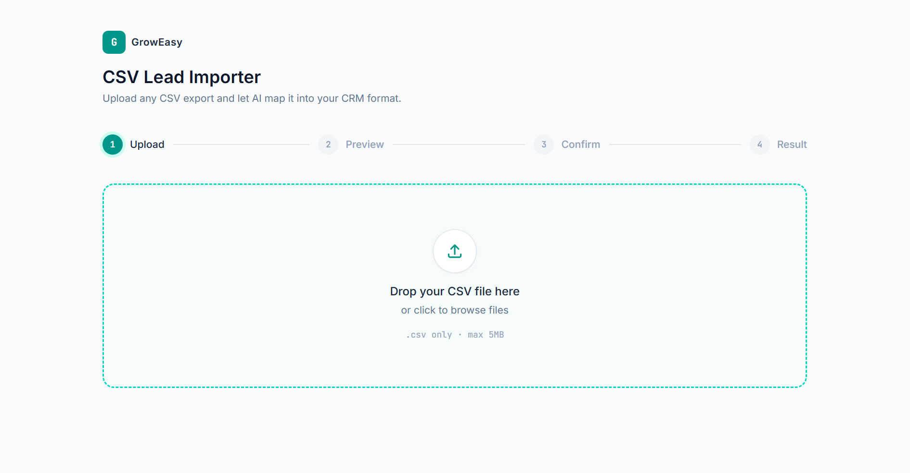
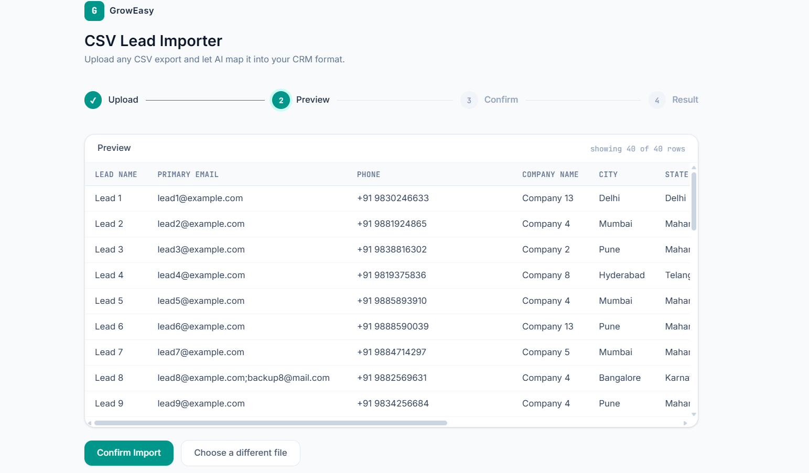
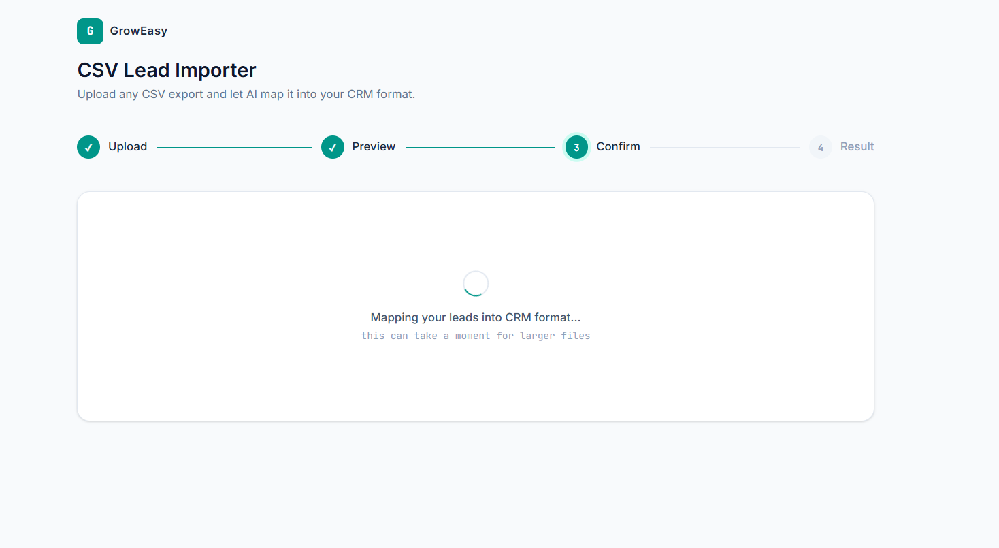
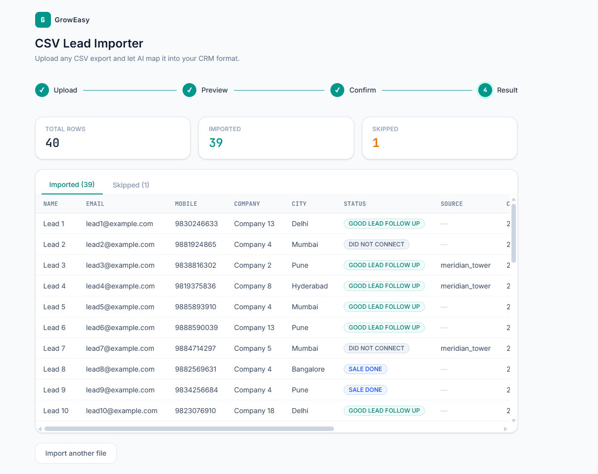

# GrowEasy AI CSV Importer

An AI-powered CSV importer that intelligently maps lead data from arbitrary CSV exports into the standardized GrowEasy CRM format.

Built as part of the **Software Developer (Intern/Full-Time) Assignment** for GrowEasy.

---

## Live Demo

**Frontend (Vercel):**
> https://groweasy-assignment-xi.vercel.app/

**Backend (Render):**
> https://groweasy-assignment-569r.onrender.com

---

# Overview

Businesses receive lead data from multiple sources including:

- Facebook Lead Ads
- Google Ads
- Excel spreadsheets
- Existing CRMs
- Manual CSV exports
- Marketing agency reports
- Real estate lead exports

Each source follows a different schema.

Instead of relying on hardcoded column mappings, this application leverages **Gemini AI** to semantically understand each CSV and convert it into GrowEasy's standardized CRM format.

---

# Features

- AI-powered semantic field mapping
- Supports arbitrary CSV structures
- CSV preview before processing
- Batch AI processing
- Retry mechanism for failed AI requests
- Validation layer for AI responses
- Responsive UI
- Dockerized application
- Fully deployed frontend & backend

---

# Architecture

```
                    CSV Upload
                         │
                         ▼
                CSV Parsing Service
                         │
                         ▼
                 Batch Processing
                         │
                         ▼
              Gemini AI Extraction
                         │
                         ▼
             Validation & Normalization
                         │
                         ▼
             GrowEasy CRM JSON Output
```

---

# Tech Stack

## Frontend

- Next.js
- React
- TypeScript
- Tailwind CSS

## Backend

- Node.js
- Express
- TypeScript
- Multer
- csv-parse

## AI

- Google Gemini 2.5 Flash

## Deployment

- Vercel
- Render

## Containerization

- Docker
- Docker Compose

---

# Application Workflow

### Step 1

Upload any valid CSV.

Supports CSV exports from multiple sources without assuming fixed column names.

---

### Step 2

Preview uploaded data before any AI processing.

Displays:

- Parsed headers
- Parsed rows
- Total records

---

### Step 3

Confirm Import

Only after user confirmation does the frontend send the CSV to the backend.

---

### Step 4

AI Extraction

Records are:

- Parsed
- Split into configurable batches
- Processed through Gemini AI
- Validated
- Converted into GrowEasy CRM schema

---

### Step 5

Results

Displays

- Successfully imported records
- Skipped records
- Import summary

---

# AI Prompt Engineering

The application uses a structured prompt designed specifically for CRM normalization.

The prompt enforces:

- Semantic column mapping
- Strict JSON output
- Allowed CRM status values
- Allowed data source values
- JavaScript-compatible date formatting
- Handling of multiple emails and phone numbers
- Empty strings instead of hallucinated values
- Preservation of row ordering
- CRM note aggregation
- Deterministic responses (`temperature = 0`)

---

# Validation Layer

The AI output is never trusted directly.

Each extracted record is validated before being returned.

Validation includes:

- Valid date checking
- Enum validation
- Contact information validation
- Skip logic
- Data normalization

---

# Reliability Features

To improve production readiness, the backend includes:

- Batch processing
- Retry mechanism for transient AI failures
- Response validation
- JSON sanitization
- Graceful handling of failed batches
- Error handling

---

# Assignment Requirements Checklist

## Frontend

- [x] Upload CSV
- [x] CSV Preview
- [x] Responsive tables
- [x] Confirmation before import
- [x] Display parsed CRM records
- [x] Import summary
- [x] Loading state

---

## Backend

- [x] Accept CSV uploads
- [x] Parse CSV files
- [x] AI-powered field extraction
- [x] Batch processing
- [x] Structured JSON response
- [x] Validation layer
- [x] Skip invalid records

---

## CRM Rules

- [x] Allowed CRM status validation
- [x] Allowed data source validation
- [x] JavaScript-compatible dates
- [x] Multiple email handling
- [x] Multiple phone handling
- [x] CRM note aggregation
- [x] Invalid record skipping

---

# Bonus Features Implemented

- [x] Retry mechanism for failed AI batches
- [x] Docker setup
- [x] Deployment (Vercel + Render)
- [x] Well-written documentation (README)

---

# Project Structure

```
groweasy-csv-importer
│
├── client
│   ├── components
│   ├── app
│   ├── lib
│   └── types
│
├── server
│   ├── routes
│   ├── middleware
│   ├── services
│   ├── config
│   └── types
│
└── docker-compose.yml
```

---

# Screenshots

## Upload



---

## CSV Preview



---

## AI Processing



---

## Results



---

# Docker

## Build

```bash
docker compose build
```

## Run

```bash
docker compose up
```

The application starts:

Frontend

```
http://localhost:3000
```

Backend

```
http://localhost:4000
```

---

# Local Development

## Frontend

```bash
cd client

npm install

npm run dev
```

---

## Backend

```bash
cd server

npm install

npm run dev
```

---

# Environment Variables

## Backend

```env
GEMINI_API_KEY=YOUR_GEMINI_API_KEY

PORT=4000

CLIENT_ORIGIN=http://localhost:3000
```

---

## Frontend

```env
NEXT_PUBLIC_API_URL=http://localhost:4000
```

---

# Notes

This implementation prioritizes:

- Clean architecture
- AI prompt engineering
- Maintainable backend design
- Production-oriented validation
- Robust error handling
- Configurable batch processing
- Clear user experience

---

Built for the GrowEasy Software Developer Assignment.
